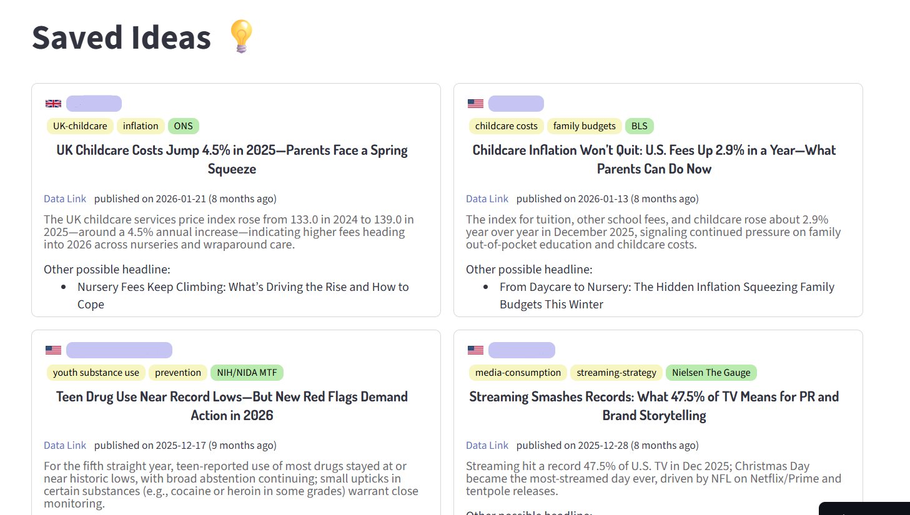

# DPR Idea Generator

A Streamlit app that searches for the latest relevant data on a company and
its industry, then generates data-driven PR (DPR) article ideas from it.

🔗 **Live demo:** https://dpr-idea-generator.streamlit.app/

## What it does

DPR Idea Generator takes a company and industries as input, searches the
web for current, relevant data and trends, and turns that research into a
set of data-driven PR article/story ideas — angles a content or PR team
could pitch or write from.

## Why

Coming up with fresh, timely data-driven PR angles usually means manually
digging through news, reports, and stats for a client's industry. This tool
automates that research step and turns it directly into usable story ideas.

## Features

- Searches the web for up-to-date data/news relevant to a given company and industry
- Uses OpenAI's web search to pull in current, real-world information
- Generates a list of data-driven PR (DPR) article idea suggestions
- Built with Streamlit for a simple, interactive interface

## Tech stack

- **Python**
- **Streamlit** — app framework / UI
- **OpenAI API** — web search + idea generation

